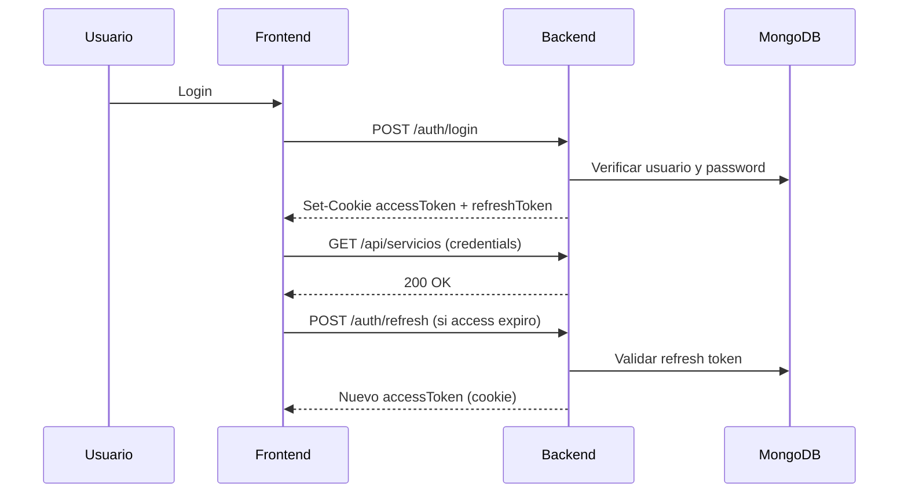

# Revision de Seguridad - Backend Node.js/Express + MongoDB

## Tabla de contenidos
- [Resumen](#resumen)
- [Vulnerabilidades encontradas](#vulnerabilidades-encontradas)
- [Codigo mejorado por punto](#codigo-mejorado-por-punto)
- [CORS recomendado](#cors-recomendado)
- [Rate limiting y anti fuerza bruta](#rate-limiting-y-anti-fuerza-bruta)
- [Validacion robusta (Zod/Joi)](#validacion-robusta-zodjoi)
- [Headers de seguridad](#headers-de-seguridad)
- [Estrategia segura de tokens](#estrategia-segura-de-tokens)
- [Checklist de hardening](#checklist-de-hardening)

## Resumen
Estado actual revisado:
- JWT y bcryptjs presentes (base correcta).
- Token almacenado en `localStorage` en frontend (`Authcontext.jsx`, `api.js`).
- CORS global sin restriccion en backend (`app.use(cors())`).
- Sin `helmet`, sin `rate limiting`, sin validacion formal por schema.
- Archivo `.env` con `JWT_SECRET` debil y expuesto localmente.

## Vulnerabilidades encontradas

| # | Riesgo | Severidad | Evidencia | Recomendacion |
|---|---|---|---|---|
| 1 | Token JWT en `localStorage` (XSS -> robo de sesion) | Alta | `frontend/src/context/Authcontext.jsx`, `frontend/src/api/api.js` | Migrar a cookie `httpOnly` + `Secure` + `SameSite` |
| 2 | CORS abierto globalmente | Alta | `Backend/index.js` | Lista blanca por ambiente + `credentials` controlado |
| 3 | Sin rate limiting en login/registro | Alta | Rutas auth | `express-rate-limit` + `express-slow-down` |
| 4 | Sin headers de seguridad | Alta | `Backend/index.js` | `helmet()` con CSP y politicas de frame/referrer |
| 5 | Validacion incompleta y manual | Media/Alta | controladores auth/servicios | Zod/Joi centralizado + sanitizacion |
| 6 | Riesgo de NoSQL injection por entradas no tipadas | Media | Queries con datos de req.body | Validar tipo estricto (`z.string()`) |
| 7 | Manejo de secreto JWT debil | Alta | `Backend/.env` (`JWT_SECRET= Jeronimo2028`) | Secretos robustos, rotacion, nunca commitear |
| 8 | Sin rotacion/revocacion de refresh tokens | Media | arquitectura actual stateless basica | Implementar refresh token en cookie + hash en BD |

## Codigo mejorado por punto

### 1) Cookies httpOnly en login
```js
const ACCESS_TTL_MS = 15 * 60 * 1000; // 15 min
const REFRESH_TTL_MS = 7 * 24 * 60 * 60 * 1000; // 7 dias

function cookieOptions(maxAge) {
  return {
    httpOnly: true,
    secure: process.env.NODE_ENV === 'production',
    sameSite: 'lax',
    path: '/',
    maxAge,
  };
}

// login controller
res
  .cookie('accessToken', accessToken, cookieOptions(ACCESS_TTL_MS))
  .cookie('refreshToken', refreshToken, cookieOptions(REFRESH_TTL_MS))
  .status(200)
  .json({ user: safeUser });
```

### 2) Logout seguro
```js
res
  .clearCookie('accessToken', { path: '/' })
  .clearCookie('refreshToken', { path: '/' })
  .status(200)
  .json({ message: 'Sesion cerrada' });
```

### 3) Password hashing y politica
```js
const BCRYPT_ROUNDS = Number(process.env.BCRYPT_SALT_ROUNDS || 12);

// en schema pre-save
if (this.isModified('password')) {
  this.password = await bcrypt.hash(this.password, BCRYPT_ROUNDS);
}

// password policy con zod
const passwordSchema = z
  .string()
  .min(8)
  .max(72)
  .regex(/[A-Z]/)
  .regex(/[a-z]/)
  .regex(/[0-9]/);
```

### 4) Sanitizacion anti NoSQL injection
```js
const { z } = require('zod');

const loginSchema = z.object({
  body: z.object({
    correo: z.string().trim().toLowerCase().email(),
    password: z.string().min(8).max(72),
  }),
  query: z.object({}).passthrough(),
  params: z.object({}).passthrough(),
});

// solo se usa req.validated.body
const { correo, password } = req.validated.body;
const user = await Usuario.findOne({ correo });
```

### 5) Helmet base
```js
const helmet = require('helmet');

app.use(
  helmet({
    contentSecurityPolicy: {
      directives: {
        defaultSrc: ["'self'"],
        scriptSrc: ["'self'"],
        styleSrc: ["'self'", "'unsafe-inline'"],
        imgSrc: ["'self'", 'data:'],
        connectSrc: ["'self'", process.env.FRONTEND_URL],
      },
    },
    crossOriginOpenerPolicy: { policy: 'same-origin' },
    referrerPolicy: { policy: 'no-referrer' },
    frameguard: { action: 'deny' },
  })
);
```

## CORS recomendado
```js
const cors = require('cors');

const allowedOrigins = (process.env.CORS_ORIGINS || '')
  .split(',')
  .map((o) => o.trim())
  .filter(Boolean);

app.use(
  cors({
    origin(origin, cb) {
      if (!origin) return cb(null, true); // Postman/curl
      if (allowedOrigins.includes(origin)) return cb(null, true);
      return cb(new Error('Origen no permitido por CORS'));
    },
    credentials: true,
    methods: ['GET', 'POST', 'PUT', 'PATCH', 'DELETE'],
    allowedHeaders: ['Content-Type', 'Authorization'],
    maxAge: 86400,
  })
);
```

## Rate limiting y anti fuerza bruta
```js
const rateLimit = require('express-rate-limit');
const slowDown = require('express-slow-down');

const authLimiter = rateLimit({
  windowMs: 15 * 60 * 1000,
  max: 8,
  standardHeaders: true,
  legacyHeaders: false,
  message: { message: 'Demasiados intentos. Intenta mas tarde.' },
});

const authSlowdown = slowDown({
  windowMs: 15 * 60 * 1000,
  delayAfter: 4,
  delayMs: () => 500,
});

app.use('/api/usuarios/login', authLimiter, authSlowdown);
app.use('/api/usuarios/registro', authLimiter);
```

Recomendacion adicional:
- Bloqueo temporal por usuario/IP tras N intentos fallidos.
- Registrar intentos fallidos para analitica de abuso.

## Validacion robusta (Zod/Joi)

### Opcion A: Zod (recomendada para stack JS moderno)
- Ventaja: tipado inferido, parsing seguro, errores estructurados.

### Opcion B: Joi
```js
const Joi = require('joi');

const registerSchema = Joi.object({
  nombre: Joi.string().trim().min(2).max(80).required(),
  correo: Joi.string().email().required(),
  password: Joi.string()
    .min(8)
    .pattern(/[A-Z]/)
    .pattern(/[a-z]/)
    .pattern(/[0-9]/)
    .required(),
  rol: Joi.string().valid('cliente', 'trabajador').required(),
  telefono: Joi.string().pattern(/^[0-9+\-\s()]{7,20}$/).allow(''),
});
```

## Headers de seguridad
Aplicar como minimo:
- `Strict-Transport-Security` (solo produccion HTTPS)
- `X-Content-Type-Options: nosniff`
- `X-Frame-Options: DENY`
- `Referrer-Policy: no-referrer`
- `Cross-Origin-Resource-Policy: same-site`
- `Permissions-Policy` (camara, geolocalizacion, microfono deshabilitados si no se usan)

`helmet` cubre gran parte de esto automaticamente.

## Estrategia segura de tokens

### localStorage vs cookies httpOnly
- `localStorage`: facil de usar, vulnerable a XSS.
- `httpOnly cookies`: no accesibles por JS, mejor frente a XSS.

Recomendacion para LaborApp:
1. Access token corto (10-15 min) en cookie `httpOnly`.
2. Refresh token largo (7 dias) en cookie `httpOnly` + hash en BD.
3. Endpoint `/auth/refresh` para renovar access token.
4. Rotacion de refresh token en cada renovacion.
5. Invalidar refresh token en logout.

### Flujo sugerido


## Checklist de hardening
- [ ] Migrar autenticacion a cookies `httpOnly`
- [ ] Agregar `cookie-parser`
- [ ] Configurar CORS con whitelist por ambiente
- [ ] Agregar `helmet`
- [ ] Limiter en auth y global API
- [ ] Validacion centralizada Zod/Joi
- [ ] Estandarizar respuestas de error (sin filtrar detalles internos)
- [ ] Rotar y reforzar secretos JWT
- [ ] Agregar auditoria de logs de seguridad
- [ ] Testear escenarios de abuso (fuerza bruta, payload invalido, token expirado)

Con este baseline, el backend pasa de un nivel academico funcional a un nivel mucho mas cercano a produccion segura.
