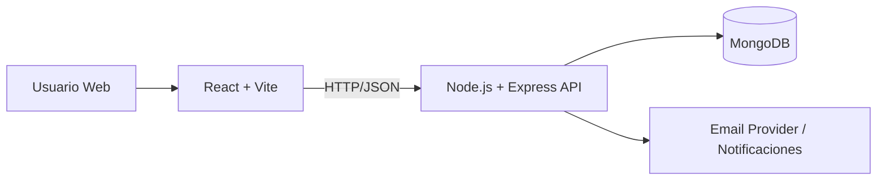
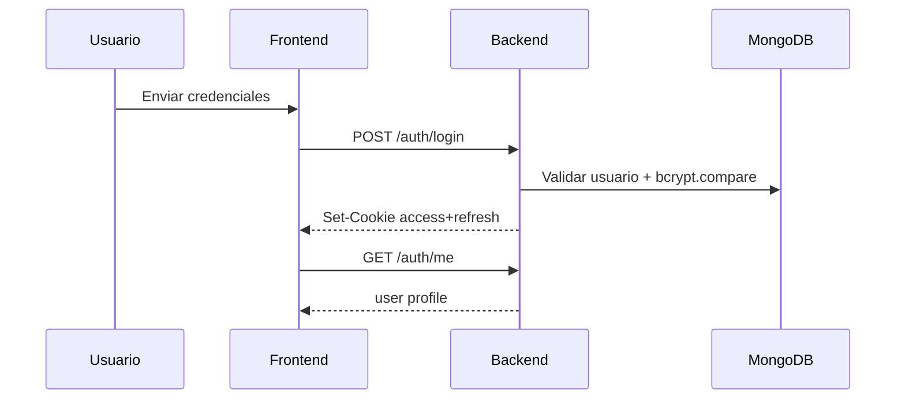

# Arquitectura y Base de Datos - LaborApp

## Tabla de contenidos
- [Vista de arquitectura](#vista-de-arquitectura)
- [Flujo de autenticacion](#flujo-de-autenticacion)
- [Esquema de base de datos](#esquema-de-base-de-datos)
- [Convenciones de API](#convenciones-de-api)

## Vista de arquitectura


## Flujo de autenticacion


## Esquema de base de datos

## User
```js
{
  _id,
  nombre: String,
  correo: String, // unique, lowercase
  password: String, // hash bcrypt
  rol: 'cliente' | 'trabajador' | 'admin',
  telefono: String,
  oficioCategoria: String,
  oficio: String,
  bio: String,
  avatarUrl: String,
  ciudad: String,
  createdAt,
  updatedAt
}
```

## Service
```js
{
  _id,
  titulo: String,
  descripcion: String,
  precio: Number,
  categoria: String,
  oficioCategoria: String,
  oficio: String,
  correoContacto: String,
  telefonoContacto: String,
  usuario: ObjectId, // ref User
  createdAt,
  updatedAt
}
```

## Review (propuesto)
```js
{
  _id,
  servicio: ObjectId,
  trabajador: ObjectId,
  cliente: ObjectId,
  rating: Number,
  comentario: String,
  createdAt,
  updatedAt
}
```

## Conversation + Message (propuesto)
```js
// Conversation
{
  _id,
  participantes: [ObjectId],
  servicio: ObjectId,
  lastMessageAt: Date,
  createdAt,
  updatedAt
}

// Message
{
  _id,
  conversationId: ObjectId,
  senderId: ObjectId,
  body: String,
  readBy: [ObjectId],
  createdAt
}
```

## Notification (propuesto)
```js
{
  _id,
  userId: ObjectId,
  type: String,
  title: String,
  payload: Object,
  readAt: Date | null,
  createdAt
}
```

## Convenciones de API
- Prefix: `/api`
- Auth endpoints: `/api/auth/*`
- Recursos REST: `/api/servicios`, `/api/reviews`, `/api/notificaciones`
- Respuesta estandar:
```json
{
  "data": {},
  "meta": {},
  "error": null
}
```
