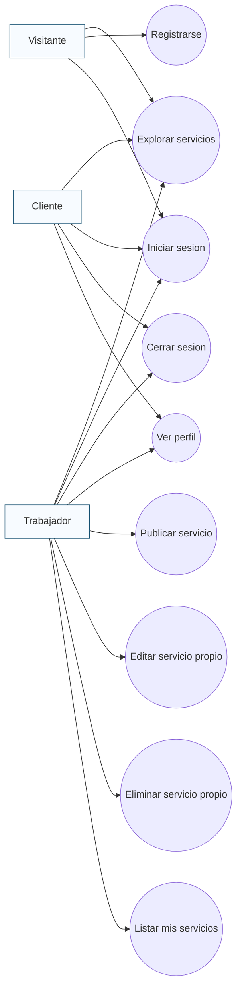
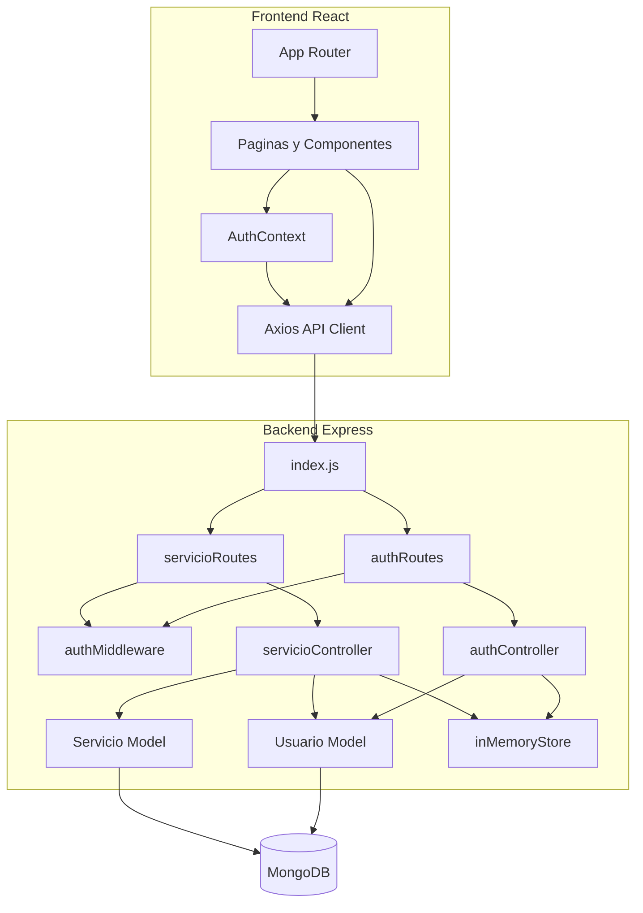
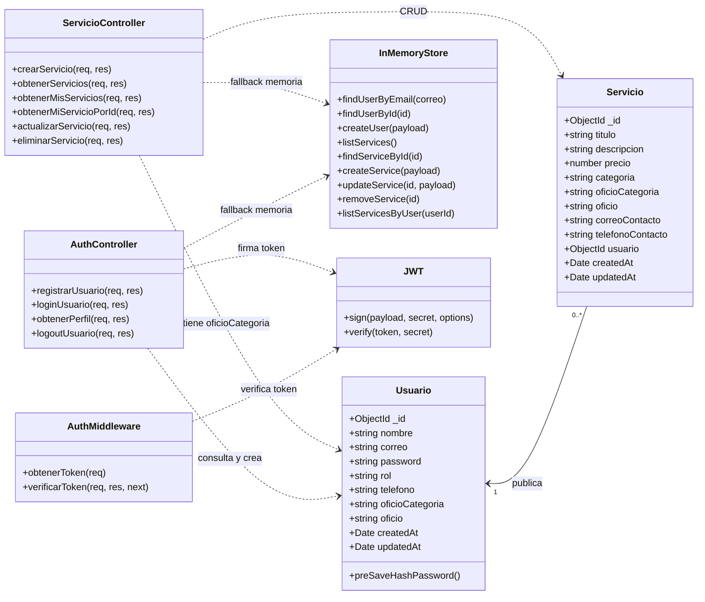
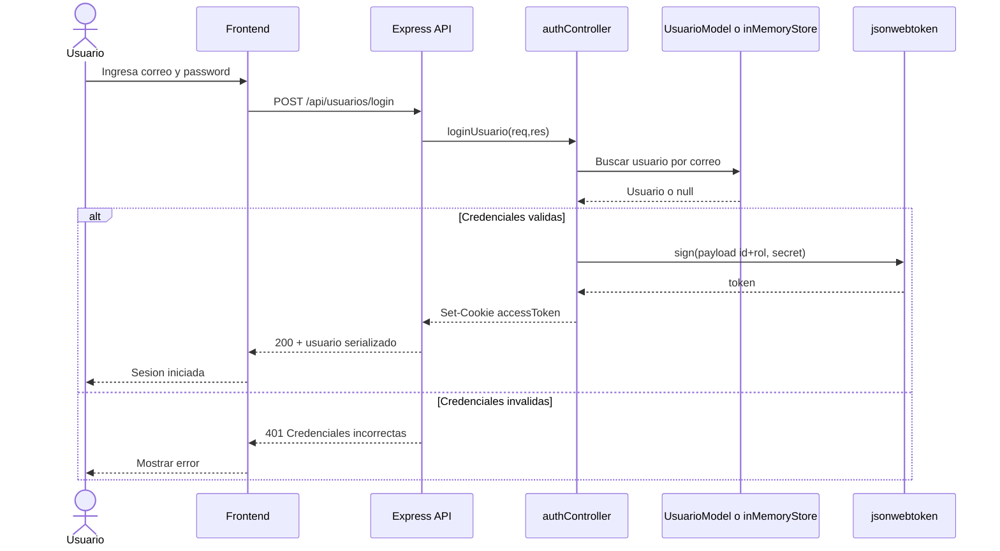
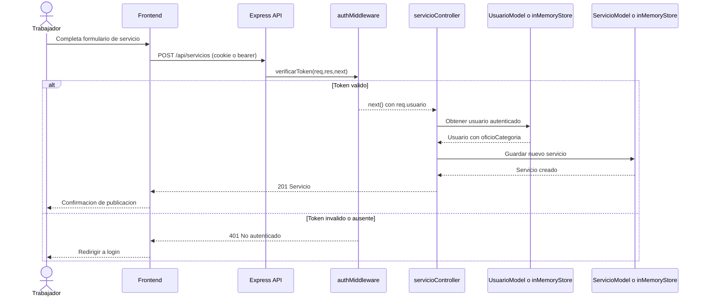
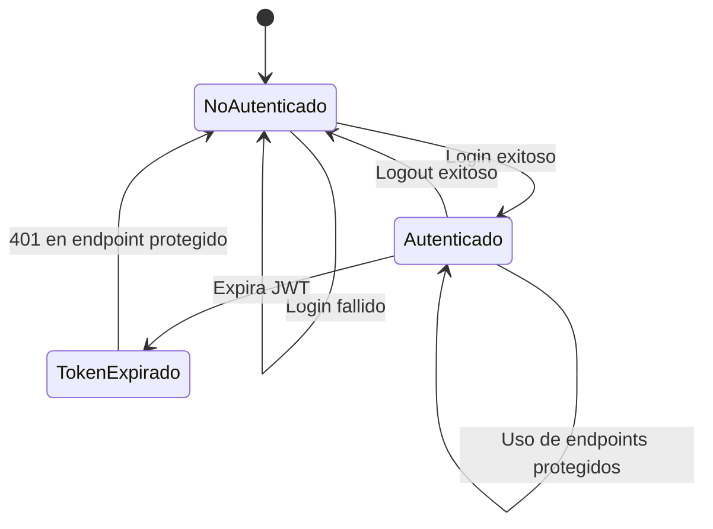
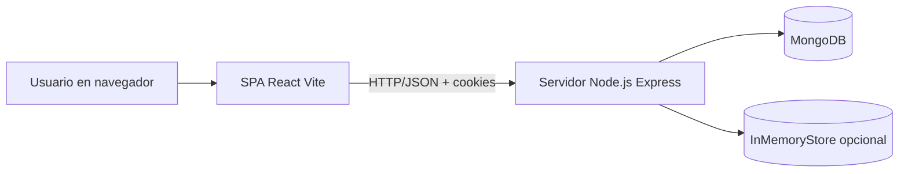
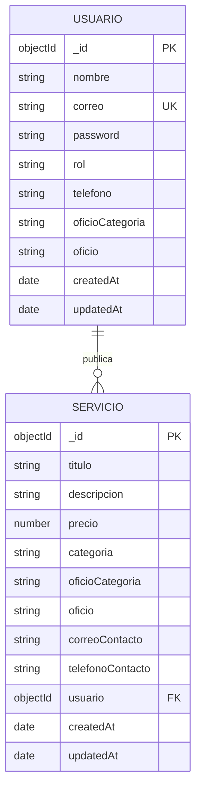

# Diagramas UML y Modelo Entidad-Relacion - LaborApp

## 1. Alcance
Este documento describe el sistema **actual** implementado en `Backend/` y `frontend/`.
Incluye:
- diagramas UML completos del flujo funcional y la arquitectura.
- modelo entidad-relacion detallado de la persistencia.

## 2. Diagrama de Casos de Uso (UML)

## 3. Diagrama de Componentes (UML)

## 4. Diagrama de Clases (UML) - Dominio y Aplicacion

## 5. Diagrama de Secuencia (UML) - Login

## 6. Diagrama de Secuencia (UML) - Crear Servicio

## 7. Diagrama de Estados (UML) - Sesion de Usuario

## 8. Diagrama de Despliegue (UML)

## 9. Modelo Entidad-Relacion (Detallado)

### 9.1. ER Logico

### 9.2. Cardinalidades y reglas
- Un `USUARIO` puede tener **cero o muchos** `SERVICIO`.
- Un `SERVICIO` pertenece a **exactamente un** `USUARIO`.
- `USUARIO.correo` es unico.
- Si `USUARIO.rol = trabajador`, los campos `telefono`, `oficioCategoria` y `oficio` son obligatorios por regla de negocio.
- `SERVICIO.precio` debe ser mayor o igual a 0.
- `SERVICIO.usuario` es FK hacia `USUARIO._id` (referencia Mongoose).

### 9.3. Diccionario de datos

#### Entidad: USUARIO
| Campo | Tipo | Requerido | Restricciones | Descripcion |
|---|---|---|---|---|
| `_id` | ObjectId | Si | PK | Identificador unico |
| `nombre` | String | Si | trim | Nombre del usuario |
| `correo` | String | Si | unique, lowercase, email | Correo de acceso |
| `password` | String | Si | hash bcrypt | Contrasena cifrada |
| `rol` | String | Si | `cliente` o `trabajador` | Tipo de usuario |
| `telefono` | String | Condicional | regex telefono | Contacto del trabajador |
| `oficioCategoria` | String | Condicional | trim | Categoria laboral |
| `oficio` | String | Condicional | trim | Especialidad |
| `createdAt` | Date | Si | auto timestamp | Fecha creacion |
| `updatedAt` | Date | Si | auto timestamp | Fecha actualizacion |

#### Entidad: SERVICIO
| Campo | Tipo | Requerido | Restricciones | Descripcion |
|---|---|---|---|---|
| `_id` | ObjectId | Si | PK | Identificador unico |
| `titulo` | String | Si | 3-120 chars | Titulo de la oferta |
| `descripcion` | String | Si | 10-1000 chars | Detalle del servicio |
| `precio` | Number | Si | min 0 | Precio ofertado |
| `categoria` | String | Si | trim | Categoria principal |
| `oficioCategoria` | String | Si | default `General` | Categoria del oficio |
| `oficio` | String | Si | trim | Especialidad ofrecida |
| `correoContacto` | String | Si | lowercase, email | Correo visible en oferta |
| `telefonoContacto` | String | Si | regex telefono | Celular visible en oferta |
| `usuario` | ObjectId | Si | FK -> `USUARIO._id` | Propietario del servicio |
| `createdAt` | Date | Si | auto timestamp | Fecha creacion |
| `updatedAt` | Date | Si | auto timestamp | Fecha actualizacion |

### 9.4. Indices implementados
- En `USUARIO`:
  - indice unico en `correo` (por `unique: true`).
- En `SERVICIO`:
  - indice compuesto: `{ categoria: 1, oficio: 1, createdAt: -1 }`.
  - indice de texto: `{ titulo: "text", descripcion: "text", oficio: "text" }`.
  - indice compuesto: `{ usuario: 1, createdAt: -1 }`.

## 10. Notas tecnicas
- El sistema soporta persistencia dual:
  - MongoDB (modo normal).
  - almacenes en memoria (`USE_IN_MEMORY_DB=true`) para demo/desarrollo.
- El modelo ER representa el esquema de persistencia principal (MongoDB), manteniendo equivalencia funcional con el store en memoria.
